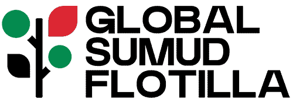

# Global Sumud Flotilla Tracker

Real-time vessel tracking application for the Global Sumud Flotilla - monitoring 22+ vessels sailing to Gaza.



## 🚢 About

This application provides live GPS tracking and historical playback of the Global Sumud Flotilla, a coordinated fleet of vessels sailing from Mediterranean ports (Barcelona, Genoa, Menorca, and Bizerte) to Gaza.

**Features:**
- 📍 Real-time vessel tracking with GPS coordinates
- 🗺️ Interactive map with vessel trajectories
- ⏱️ Historical playback (Sep 1 - Oct 1, 2025)
- 🔴 Live mode with 3-second updates
- 📊 Vessel information panel with speed, heading, and tracker IDs

## 🛠️ Tech Stack

- **Frontend:** React 18 + TypeScript
- **Build Tool:** Vite
- **UI Framework:** Tailwind CSS + shadcn/ui
- **Mapping:** Leaflet with CartoDB Voyager tiles
- **State Management:** React hooks

## 🚀 Getting Started

### Prerequisites

- Node.js 18+ and npm

### Installation

```bash
# Clone the repository
git clone <repository-url>
cd liveflotilla

# Install dependencies
npm install

# Start development server
npm run dev
```

The application will be available at `http://localhost:5173` (or the next available port).

### Build for Production

```bash
# Production build
npm run build

# Preview production build
npm preview
```

## 📁 Project Structure

```
src/
├── components/
│   ├── MapView.tsx          # Leaflet map with vessel markers
│   ├── Timeline.tsx         # Historical playback controls
│   ├── VesselList.tsx       # List of vessels
│   └── InfoPanel.tsx        # Information panel
├── services/
│   └── vesselService.ts     # Core tracking logic & GPS simulation
├── data/
│   └── realFlotillaData.ts  # Real vessel data from news sources
└── pages/
    └── Index.tsx            # Main application page
```

## 🎯 Key Features

### Interactive Map
- **Live tracking** of 22 vessels
- **Trajectory visualization** showing vessel paths
- **Popup details** with vessel name, speed, heading, and GPS coordinates
- **CartoDB Voyager** tiles for clean, modern appearance

### Timeline Controls
- ▶️ **Play/Pause** - Automatic historical playback
- 🔴 **LIVE Mode** - Real-time simulation updates
- 🎚️ **Scrubber** - Manual navigation through history
- 🕐 **Date/Time Display** - Current position in timeline

### Vessel Information
Each vessel includes:
- Name (e.g., Karma, Shireen Abu Akleh, Rachel Corrie)
- Current GPS coordinates
- Speed in knots
- Heading in degrees
- Garmin tracker ID
- Departure port and date

## 📊 Data Sources

Vessel names and departure information based on:
- Al Jazeera news reports
- Wikipedia: Global Sumud Flotilla
- Official website: globalsumudflotilla.org

**Notable Vessels:**
- Karma, Alma, Familia Madeira (attacked by drones - Sept 2025)
- Shireen Abu Akleh (Al Jazeera press boat)
- Rachel Corrie, Ahed Tamimi (named after activists)
- Spirit of Humanity, Peace Runner

## 🧭 GPS Simulation

Since the official tracker has no public API, this application simulates realistic vessel movement using:
- **Nautical calculations** (speed in knots, heading in degrees)
- **Haversine formula** for distance calculations
- **Realistic variations** (±10° heading, ±1 knot speed)
- **Historical data generation** (720 points per vessel over 30 days)

Initial positions based on news reports: ~150 nautical miles west of Gaza (approximately 32.0°N, 31.5°E).

## 🔧 Development

```bash
# Start dev server with hot reload
npm run dev

# Lint code
npm run lint

# Build for production
npm run build

# Build for development (with source maps)
npm run build:dev
```

## 📱 Browser Support

- Chrome/Edge 90+
- Firefox 88+
- Safari 14+

## 📄 License

This project is for educational and monitoring purposes.

## 🤝 Related Projects

- [Global Sumud Flotilla Official Site](https://globalsumudflotilla.org/)
- [Forensic Architecture Handala Tracker](https://forensic-architecture.org/)

## ⚠️ Disclaimer

This is an independent tracking simulation. For official updates, visit [globalsumudflotilla.org](https://globalsumudflotilla.org/).

---

Built with ❤️ for peace and humanitarian aid
